# physics-light-2d

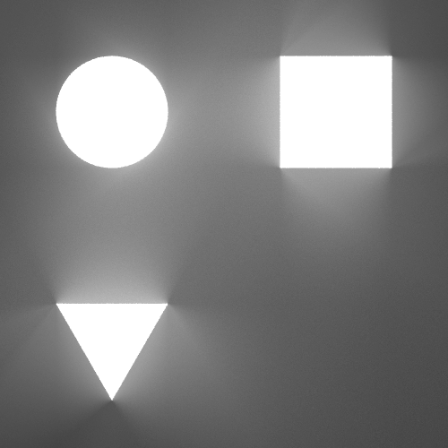

This project does **2D renderings using a Monte Carlo method**. Each pixel will be sampled multiple times, and for each sampled pixel, the lights will be sampled multiple times. 

Currently it is using RGB colors, but a later implementation should use a light spectrum for more realistic simulations.

## Rendering

### Raymarching

The rendering is done with the raymarching technique. This allows us to render all kinds of shapes, including fractals.

### Normal map

This is an example for the normal map of a scene. This map is used for debugging issues with the normals.

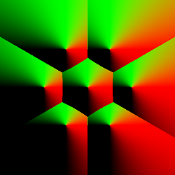

### Reflection

Reflection is done with the reflection vector. This is calculated with:

R = I - 2(I.N)*N

Where N is the normal vector, which must also be normalized.

In this example the black circles non-reflective, and reflective.

| Reflection off | Reflection on |
| -- | -- |
| 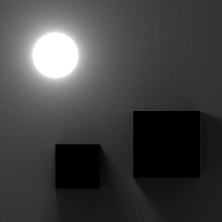 | 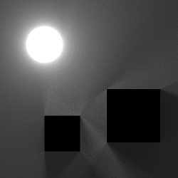 |

### Refraction

TODO

## Shapes

This is a list of all the implemented shapes. There are also the following operations that can be used to modify shapes, and/or combine shapes to create new shapes.

| Operation | Description |
| -- | -- |
| OpRound | Create rounded corners. |
| OpOnion | Cut-out the center part. |
| OpUnion | Combine two shapes. |
| OpSubtract | Subtract one shape from another. |
| OpIntersect | Intersect two shapes. |

### Circle

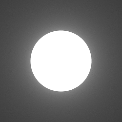

### Rectangle

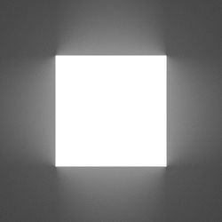

### Triangle

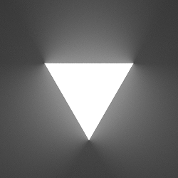

## Materials

A material is defined with the following properties:

| Property | Description | Type/Range |
| -- | -- | -- |
| DiffuseColor | The diffuse color is used when reflecting/refracting to absorb certain wavelengths. | RGBColor |
| EmissiveColor | The emissive color is used if the material emits light. | RGBColor|
| Intensity | The intensity is used to increase the intensity of the emissiveness of the material. | [0, infinity] | 
| Reflectivity | The reflectivity is used to determine how much light is reflected from the material. | [0, 1] |
| Refractivity | The refractivity is used to determine how much light is refracted through the material. | [0, 1] |
| RefractiveIndex | The refractive index is used to determine how much the light bends when refracting. | [1, 3] |
| Roughness | The roughness is used to determine how flat a surface is, a mirror has a roughness of 0, and reflects perfectly. | [0, 1] |

## Sampling methods

### Uniform

The uniform sampling method generates a random integer between [0, 1] for the pixel space, and between [0, 2pi] for the ray direction for the light samplie. A downside of this method is that there are clusters of samples that are together.

### Stratified

The stratified sampling method will sample on a grid. For each cell on the grid, there is a small random offset. This ensures that the samples can't clump together, but the aliasing effect is still present, opposed to just a grid.

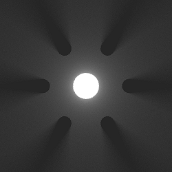

## Accelerators

### Scene Distance Buffer

The Scene Distance Buffer (SDB) generates a buffer with the distances for each pixel. Only when the step distance is below some threshold, the actual distance will be calculated. Otherwise, it is looked up in the buffer.

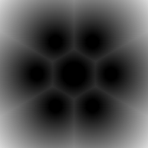

The example image is the SDB for the Hello world scene.

## Scenes

### Hello world

A simple scene with one emissive material, and a few circle to create shadows. Note that shadows are not calculated, they appear automaticcaly as a result from using the Monte Carlo method.

### Mandelbrot

A sample with a Mandelbrot distance function.

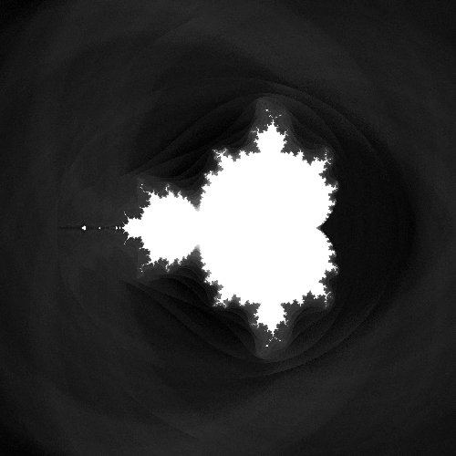

### RGB 

A scene with three emissive materials and more light intensity.

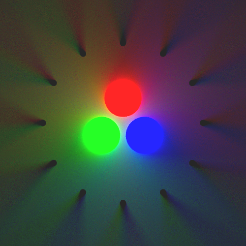