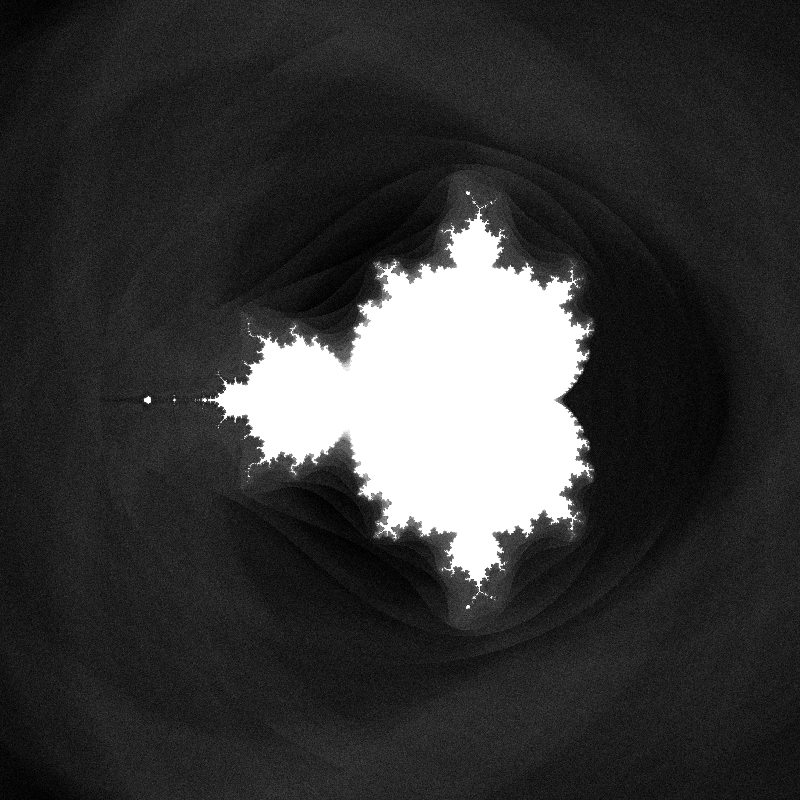
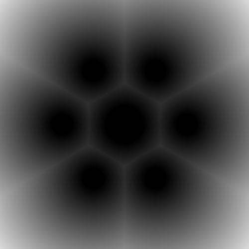

# physics-light-2d

This project does 2D renderings using a Monte Carlo method. Each pixel will be samples multiply times, and for each sampled pixel, the lights will be sample multiple times. 

Currently it is using RGB colors, but a later implementation should use a light spectrum for more realistic simulations. Using a light spectrum will allow us to shift the wavelengths when refracting through material, which is responsible for the effect a prisma gives.

## Rendering

### Raymarching

The rendering is done with the raymarching technique. This allows us to render all kinds of shapes, including fractals.

## Sampling methods

### Uniform

The uniform sampling method generates a random integer between [0, 1] for the pixel space, and between [0, 2pi] for the ray direction for the light samplie. A downside of this method is that there are clusters of samples that are together.

### Stratified

The stratified sampling method will sample on a grid. For each cell on the grid, there is a small random offset. This ensures that the samples can't clump together, but the aliasing effect is still present, opposed to just a grid.

## Scenes

### Hello world

A simple scene with one emissive material, and a few circle to create shadows. Note that shadows are not calculated, they appear automaticcaly as a result from using the Monte Carlo method.

### Mandelbrot

A sample with a Mandelbrot distance function.

### RGB 

A scene with three emissive materials and more light intensity.

## Accelerators

### Scene Distance Buffer

The Scene Distance Buffer (SDB) generates a buffer with the distances for each pixel. Only when the step distance is below some threshold, the actual distance will be calculated. Otherwise, it is looked up in the buffer.

