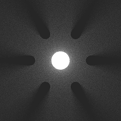

# physics-light-2d

This project does 2D renderings using a Monte Carlo method. Each pixel will be sampled multiple times, and for each sampled pixel, the lights will be sampled multiple times. 

Currently it is using RGB colors, but a later implementation should use a light spectrum for more realistic simulations. Using a light spectrum will allow us to shift the wavelengths when refracting through material, which is responsible for the effect a prisma gives.

## Rendering

### Raymarching

The rendering is done with the raymarching technique. This allows us to render all kinds of shapes, including fractals.

### Reflection

TODO

### Refraction

TODO

## Materials

A material is defined with the following properties:

| Property | Description | Type/Range |
| -- | -- | -- |
| DiffuseColor | The diffuse color is used when reflecting/refracting to absorb certain wavelengths. | RGBColor |
| EmissiveColor | The emissive color is used if the material emits light. | RGBColor|
| Intensity | The intensity is used to increase the intensity of the emissiveness of the material. | [0, infinity] | 
| Reflectivity | The reflectivity is used to determine how much light is reflected from the material. | [0, 1] |
| Refractivity | The refractivity is used to determine how much light is refracted through the material. | [0, 1] |
| RefractiveIndex | The refractive index is used to determine how much the light bends when refracting. | [1, 3] |
| Roughness | The roughness is used to determine how flat a surface is, a mirror has a roughness of 0, and reflects perfectly. | [0, 1] |

## Sampling methods

### Uniform

The uniform sampling method generates a random integer between [0, 1] for the pixel space, and between [0, 2pi] for the ray direction for the light samplie. A downside of this method is that there are clusters of samples that are together.

### Stratified

The stratified sampling method will sample on a grid. For each cell on the grid, there is a small random offset. This ensures that the samples can't clump together, but the aliasing effect is still present, opposed to just a grid.

## Scenes

### Hello world

A simple scene with one emissive material, and a few circle to create shadows. Note that shadows are not calculated, they appear automaticcaly as a result from using the Monte Carlo method.

### Mandelbrot

A sample with a Mandelbrot distance function.

### RGB 

A scene with three emissive materials and more light intensity.

## Accelerators

### Scene Distance Buffer

The Scene Distance Buffer (SDB) generates a buffer with the distances for each pixel. Only when the step distance is below some threshold, the actual distance will be calculated. Otherwise, it is looked up in the buffer.

The example image is the SDB for the Hello world scene.